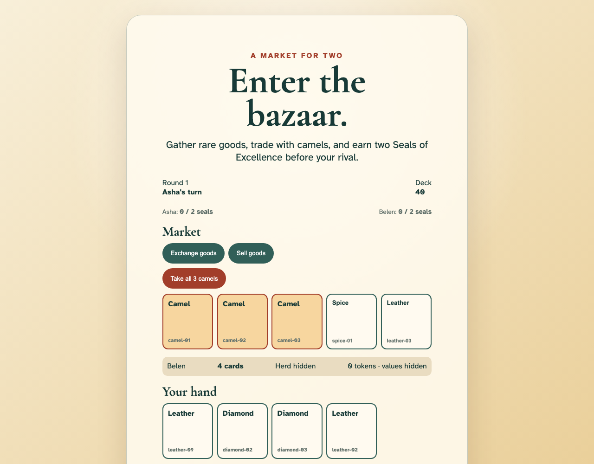
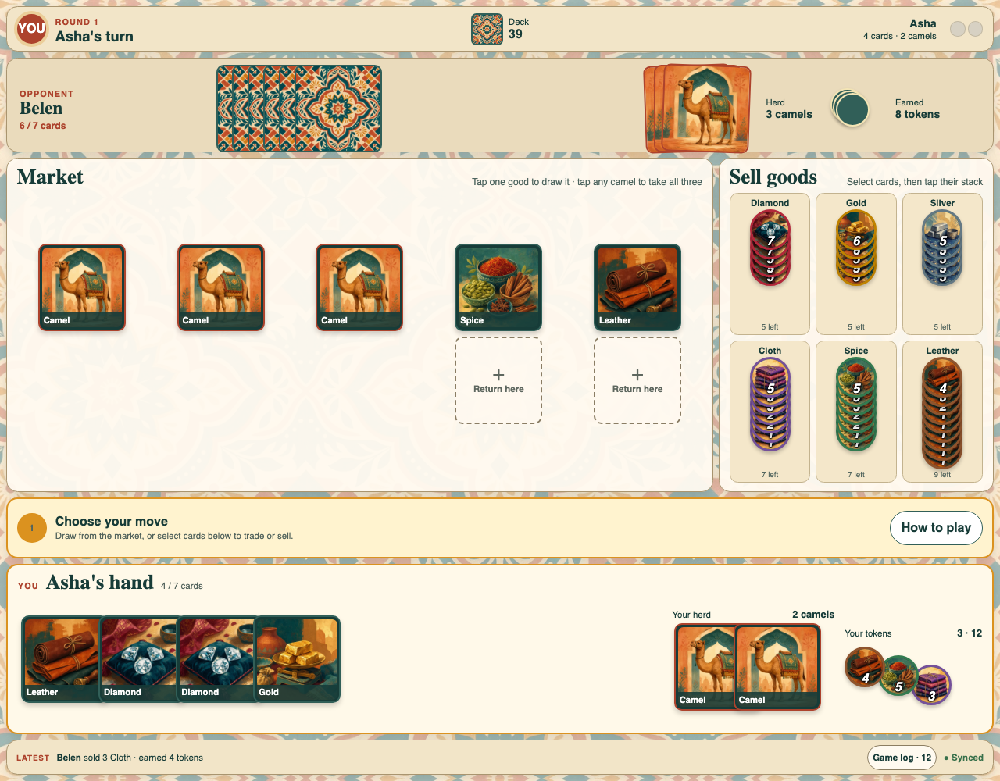
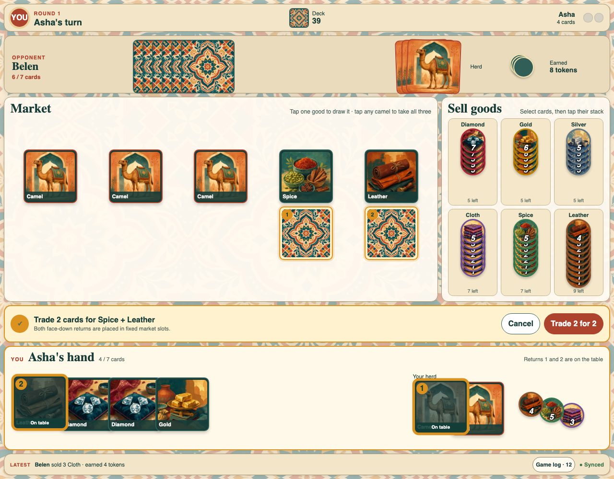
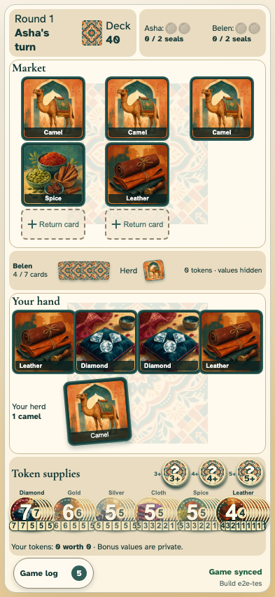
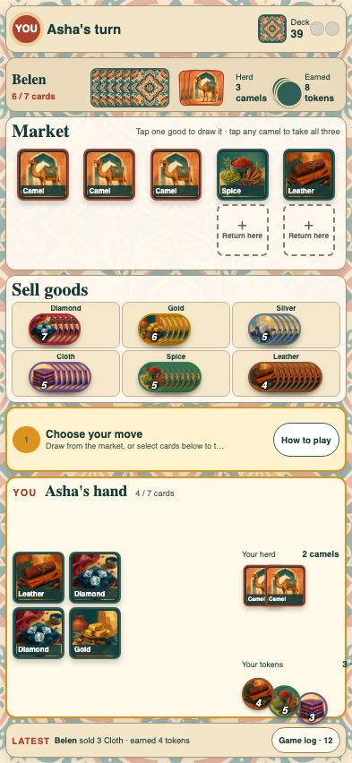
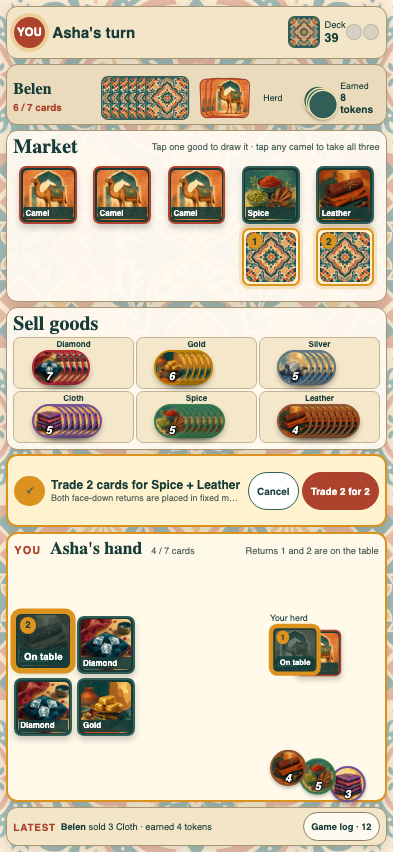

# Ordinary game UI proposal

This proposal is primarily about the ordinary desktop and phone game surfaces. The existing tabletop surface is already close to the desired experience and should receive only the limited refinements described in [Tabletop follow-up](#tabletop-follow-up).

The goal is to make the current turn, available actions, public information, and private hand understandable at a glance without scrolling. The screenshots below are generated from deterministic markup and are the visual contract for the proposed direction, not production implementation.

## Why revise the ordinary game

The desktop UI currently gives roughly equal visual weight to the market, token supply, opponent, and player. That makes the active play area feel like a dashboard of four unrelated panels. The phone UI carries the same composition into a narrow viewport, so the token bank, opponent area, and private hand compete for space while cards, labels, and controls become difficult to read.

The revised layout follows the way a turn is understood:

1. Whose turn is it?
2. What does the opponent publicly have?
3. What is available in the market and token supply?
4. What action am I assembling or confirming?
5. What private cards, camels, and tokens do I own?
6. What just happened?

Desktop and phone use the same information hierarchy. They differ in composition rather than presenting different rules or controls.

## Desktop

### Implemented production capture

This PR replaces the four similarly prominent quadrants with a compact opponent strip, a dominant fixed-slot market, a three-by-two token bank, a persistent action dock, and a full-width private tray. The capture below is generated by the real synchronized game, not the design fixture.



### Design reference: turn state



The proposed desktop composition has six stable bands:

- A compact match bar communicates turn, round, deck size, and seals.
- A shallow opponent strip shows the opponent's actual public state: hand size, herd, and token count.
- The market is the largest public surface and retains five permanent card positions.
- The token supply sits beside the market in a compact bank. Every remaining chip and rim value is still visible.
- A contextual action dock explains the next valid step and holds confirmation or cancellation controls.
- The private tray spans the near edge of the screen and contains the player's hand, graphical herd, and existing face-up earned-token stack.

The latest action and game-log entry point remain persistently visible in the footer.

### Proposed staged exchange



The layout does not reflow when an exchange starts:

- Market cards stay in their assigned slots.
- Each return target stays directly below its market destination.
- A selected hand card or camel flies to a target and becomes a face-down return card there.
- Its source in the private tray is dimmed and marked `On table`, preserving spatial memory without visually duplicating an available card.
- Return order is visible on both the source and destination.
- The action dock changes from guidance to a concise trade summary with `Cancel` and `Trade` actions.

## Phone

### Implemented production capture

The real phone surface now follows task order instead of compressing the desktop grid. It keeps the complete public state and private tray in one viewport, spreads public token stacks sideways, and retains 48-pixel chips and touch-sized controls.



### Design reference: turn state



The phone surface is ordered by task rather than desktop panel geometry:

- Turn and deck status remain visible at the top.
- Opponent public state is compressed to one readable strip.
- The five-position market remains the primary play area.
- The complete token bank becomes a compact three-by-two grid. Stacks spread sideways so rim values remain visible in limited vertical space.
- The contextual action dock separates public choices from the private tray.
- The player's hand, graphical herd, and existing earned-token stack occupy the bottom portion of the viewport.
- The latest action remains pinned at the bottom.

Nothing requires vertical or horizontal scrolling. Cards are not arbitrarily scaled between market and hand; each surface uses a deliberate physical card size appropriate to that viewport.

### Proposed staged exchange



The staged state uses the same controls and spatial model as desktop. It does not replace the phone with a wizard or modal:

- Destinations and their loaded returns are visible in the market.
- Selected private cards are visibly committed but remain recognizable at their source.
- The dock states the complete proposed trade and keeps the destructive escape and committing action adjacent.
- The market, supply, hand, herd, latest action, and public opponent state all remain visible.

## Shared interaction model

### Stable physical objects

Cards and chips should behave like objects on a table:

- The market owns five persistent slot identities for the entire round.
- Drawing or exchanging replaces the contents of a slot; it does not compact the remaining cards as an array.
- The card cell and its exchange target never change dimensions between idle, selected, pending, and resolved states.
- Incoming cards animate directly from their source to the assigned empty slot, remain absent at the destination during flight, then flip and settle.
- Cards use a consistent square footprint within a viewport. Hand overlap may vary, but the cards themselves do not stretch or shrink as they move.
- Token stacks reveal every rim value. They spread vertically where height is plentiful and sideways where width is plentiful.

### Contextual action dock

The current interface makes several interaction systems visually compete. A single persistent dock should make the state machine explicit without reverting to separate action buttons for every game rule.

| State | Dock message | Dock actions |
| --- | --- | --- |
| Player turn | Draw from the market, select cards to trade, or select matching cards to sell | Help only |
| Cards selected | Names and count of selected cards; valid next destinations | Clear selection |
| Exchange staged | Exact goods taken and exact number of returns loaded | Cancel, confirm trade |
| Draw pending | `Draw Single` or `Draw Camels`; newly revealed positions remain face down | Undo, reveal/confirm |
| Sale selected | Good, quantity, reward chips, and bonus eligibility | Cancel, sell |
| Opponent turn | Waiting for opponent, with the latest observed action | Game log |

The dock is explanatory, not a second copy of the board controls. Drawing still begins by tapping a market card, selling can still begin from either selected hand cards or a token stack, and exchanges still support clicking or drag-and-drop in either source/destination order.

### Selection and movement feedback

- Clicking and dragging must produce the same staged state.
- A click-triggered card visibly flies from source to destination; it must not appear at the destination before the flight lands.
- A dragged card follows the pointer and settles into the same destination representation.
- A loaded source is visibly unavailable until the staged action is confirmed or abandoned.
- Every committed local, remote, and bot action uses the same movement animation.
- The latest action remains visible even after its animation completes.
- Reduced-motion mode replaces flight and spin with an immediate cross-fade while preserving staging and confirmation states.

### Information boundaries

The surfaces must not imply information that Jaipur keeps private:

- The opponent strip shows hand count, a physical herd pile, and number of earned tokens, but never token values or a numeric camel count.
- The local private tray shows the player's exact hand, a physical herd pile without a numeric count, and every earned token as the existing face-up stack. It does not add a separate `Your tokens` summary.
- Disabled controls must not reveal whether another player can perform an exchange or sale.
- The deck count, market, remaining public token stacks, seals, latest action, and game log remain public.

## Responsive rules

The layout should fit the supported viewport rather than depend on scrolling.

### Wide screens

- Put market and token supply side by side.
- Spread market return targets vertically below their fixed cards.
- Spread public token supplies vertically enough to expose every rim value.
- Keep the private hand on the near edge and allow overlap only when needed to retain physical card size.

### Narrow screens

- Stack market above token supply.
- Keep all five market columns visible; use short labels and square art rather than a horizontal carousel.
- Arrange token supplies in a three-by-two grid and spread each stack sideways.
- Recompose the private tray into hand and status columns. Do not merely scale the desktop grid down.
- Preserve a minimum 44 by 44 CSS-pixel hit region for every actionable card, target, token stack, and confirmation control.
- Truncate secondary explanatory copy before shrinking primary labels below a readable size.

### Height pressure

When height is the limiting dimension, reduce decorative padding and secondary copy first. Do not hide public state, reduce cards to ambiguous thumbnails, or introduce page scrolling. The game surface may use the full dynamic viewport height (`100dvh`) and account for device safe-area insets.

## Tabletop follow-up

The tabletop UI keeps its existing layout and phone companion model. The three focused refinements are now implemented:

1. **Duplicate the token market visually.** Opposite full-height side rails render oriented views of the same public token inventory. Both copies update from the same round state, and the active player may sell through either one.
2. **Make market geometry legible.** The ordinary and tabletop routes share one five-slot renderer. Every tabletop card keeps a permanent center coordinate, while its return area moves between reserved positions above and below the card so it is physically nearest the active player. The draw pile sits beside the five-card row instead of above it.
3. **Turn the whole interaction toward the active player.** Turn-facing rotation is enabled by default and can be disabled with the `Facing` control. Every active instruction now occupies one inset market prompt, and persistent market/status labels face the current player. Action flights finish completely in the acting player's orientation, pause for 200 ms, and only then begin the turn rotation. Reduced-motion mode preserves the two-phase state change without prolonged motion.

Large tabletop displays continue scaling beyond the original desktop caps. At 4K, the side rails, market cards, private card backs, herds, token chips, labels, gaps, and target areas all use the available physical space while preserving the fixed market row and player-near controls.

The duplicated token views should use the same responsive stack component as ordinary play. On the tabletop's opposing edges, orientation changes but ordering, chip values, and underlying state do not.

## Mockup source and screenshots

The proposal is intentionally reproducible:

- [`tests/design/ui-fixes/ui-fixes.mockup.html`](tests/design/ui-fixes/ui-fixes.mockup.html) is deterministic semantic markup using the game's real card art.
- [`tests/design/ui-fixes/ui-fixes.spec.ts`](tests/design/ui-fixes/ui-fixes.spec.ts) loads that markup in Playwright, switches interaction states, asserts that no page scroll or broken image exists, and captures the four screenshots in this document.
- [`tests/design/playwright.config.ts`](tests/design/playwright.config.ts) supplies the local asset server and Chromium configuration.

Regenerate the visual proposal with:

```sh
bun run design:ui-fixes
```

The committed reference canvases are:

| Surface | Viewport | State |
| --- | ---: | --- |
| Desktop turn | 1280 × 1000 | Idle player turn |
| Desktop exchange | 1280 × 1000 | Two-for-two exchange staged |
| Phone turn | 393 × 852 | Idle player turn |
| Phone exchange | 393 × 852 | Two-for-two exchange staged |

The markup is a design fixture, not a parallel application. Production work should extract and reuse components rather than ship or import the fixture.

## Implementation status and follow-ups

Implemented on this PR:

1. Preserve stable five-slot market identity through draws, exchanges, pending reveal, and animation.
2. Recompose the ordinary desktop and phone surfaces around the compact opponent strip, public workspace, action dock, private tray, and latest-action footer.
3. Spread complete token supplies vertically on wide screens and sideways in a three-by-two phone bank.
4. Move pending draw, selection, exchange, sale, and waiting guidance into the contextual dock.
5. Keep click, drag, local, remote, bot, flight animation, and game-log behavior connected to the new destinations.
6. Record real synchronized-game baselines for phone, desktop, tablet, and mobile landscape in addition to the deterministic design fixture.

Follow-up work:

1. ~~Extract the stable market layout from the ordinary and tabletop routes into a shared component once both visual treatments settle.~~ Implemented with `StableMarketLayout`.
2. ~~Add the two tabletop token views and permanent slot coordinates, then evaluate the optional turn-facing rotation.~~ Implemented; rotation is default-on with an on-table opt-out.
3. Pending-draw confirmation now has an explicit tabletop baseline. Extend coverage to round and game summaries if those surfaces change.

## Acceptance criteria

- Ordinary desktop and phone match the hierarchy and state transitions shown in the proposed screenshots.
- The supported desktop and phone viewports have no page scrolling or clipped actionable content.
- Market cards and return targets never reposition when a card is selected, loaded, drawn, exchanged, revealed, or replaced.
- All public token values remain visible without dominating the phone viewport.
- The opponent's card count, graphical herd, and token count are immediately legible without exposing token values or a numeric camel count.
- Hand cards, herd cards, market cards, and in-flight cards preserve a convincing physical size and aspect ratio.
- Click and drag interactions converge on the same staged state and can be cancelled safely.
- Pending single-card and camel draws retain their existing confirm/undo semantics and global visibility.
- Bot and remote-player actions animate through the same destinations as local actions.
- The latest action and full game log remain reachable in every state.
- Keyboard focus, accessible names, contrast, 44-pixel touch targets, and reduced-motion behavior are verified alongside the visual tests.
