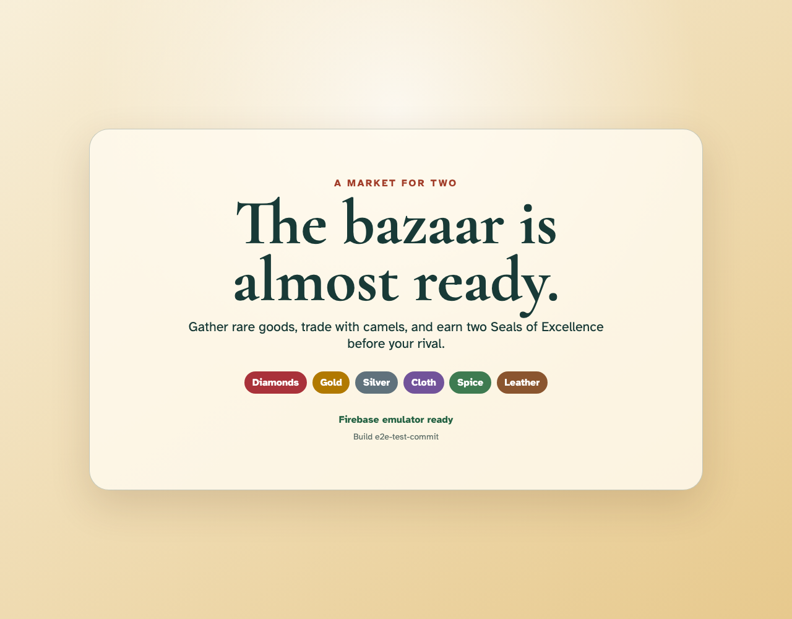

# Application shell and Firebase readiness

The static Jaipur client loads and reaches the local Firebase emulators.

## The bazaar is ready for its first traders

**Verifications:**

- [x] The page exposes the stable Jaipur title
- [x] The landing heading and six goods are visible
- [x] The client reaches the Firebase emulator
- [x] The deterministic build marker is visible
