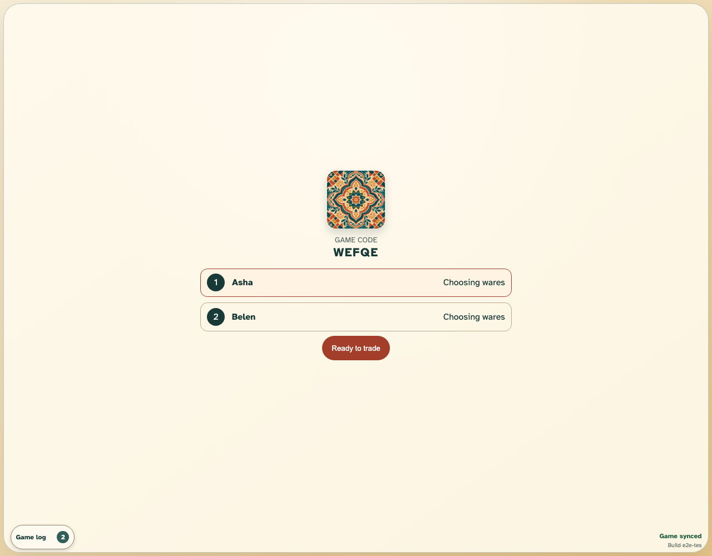

# Create and join a game

Two isolated anonymous browser contexts converge on the same Jaipur room.

## Both traders occupy the shared room

**Verifications:**

- [x] The host sees both named traders
- [x] The rival observes the same membership

## Reload replays the immutable room

**Verifications:**

- [x] Both memberships survive a host reload
