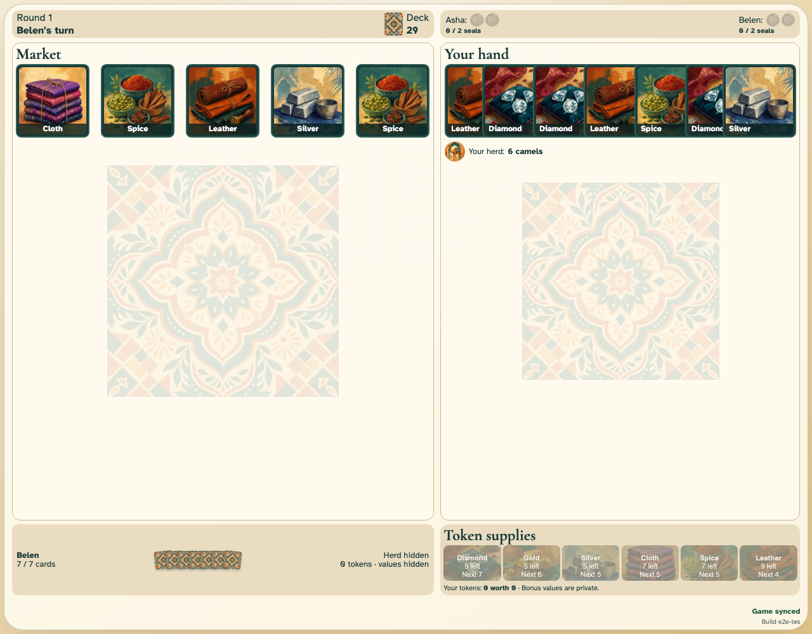

# Round setup and private hands

Two ready traders open a seeded market and receive trustworthy player views.

## The deterministic market opens

**Verifications:**

- [x] Both players see the same five-card market
- [x] The local hand is exact while the opponent has one concealed card back per card
- [x] The deck and active trader are visible

## The concealed opponent hand visibly reaches its seven-card limit

**Verifications:**

- [x] Seven overlapping square card backs make the full opponent hand visible
- [x] A full hand prevents taking another single good
