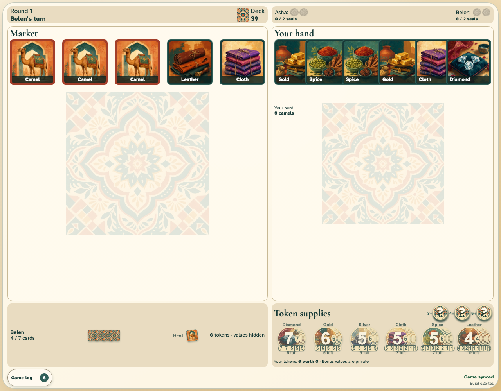

# Take one good

Asha takes one non-camel card, the deck refills its market position, and play passes.

## One good moves into Asha’s hand

**Verifications:**

- [x] The selected stable card ID is now in the local hand
- [x] The market is refilled and the deck decreases by one
- [x] Both clients agree that Belen now has the turn
- [x] The observer sees the shared action and can review older log pages
