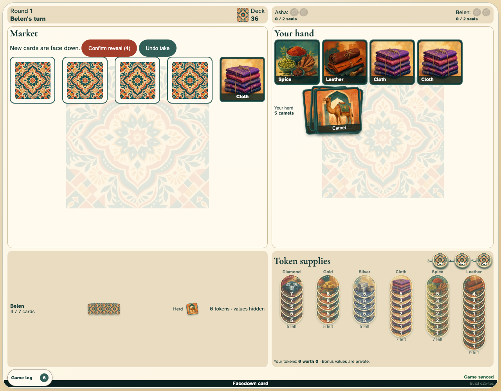

# Take all camels

Asha takes the complete camel group into her herd and the deck refills every vacancy.

## Every camel joins Asha’s herd

**Verifications:**

- [x] The local herd stack grows by the complete visible camel group
- [x] The market returns to five cards and the deck pays every replacement
- [x] Both clients advance the turn to Belen
- [x] Belen sees every camel and refill card move as one shared action
