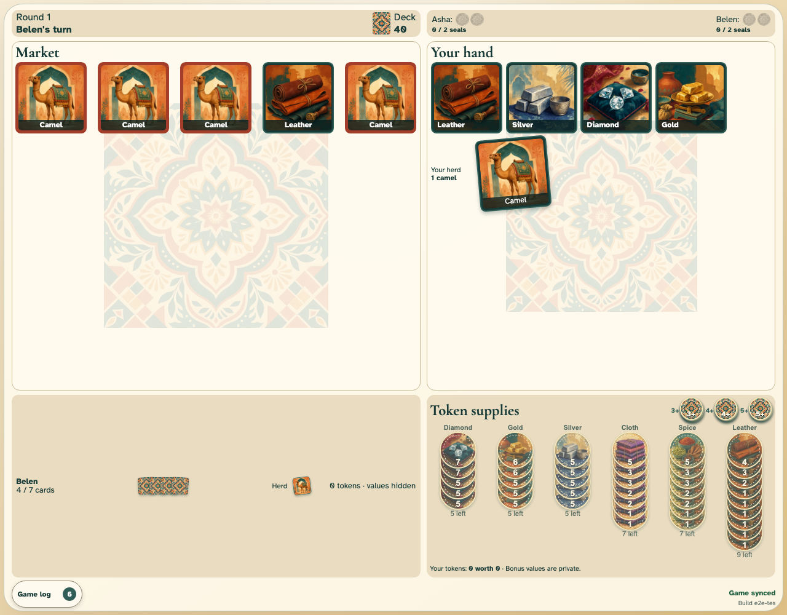

# Exchange goods

Asha selects two market goods and atomically returns one hand card and one camel.

## Two goods change zones for one hand card and one camel

**Verifications:**

- [x] Diamond and gold enter Asha’s private hand
- [x] The mixed hand-and-herd return fills the market
- [x] An exchange does not draw from the deck and both clients advance the turn
- [x] Belen sees all four committed card movements and the accepted trade in the log
