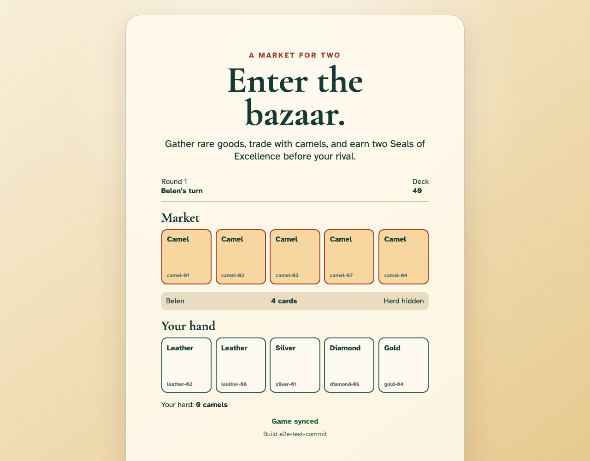

# Exchange goods

Asha selects two market goods and atomically returns the same number of camels.

## Two goods and two camels change zones together

**Verifications:**

- [x] Diamond and gold enter Asha’s private hand
- [x] The returned camels leave the herd and fill the market
- [x] An exchange does not draw from the deck and both clients advance the turn
