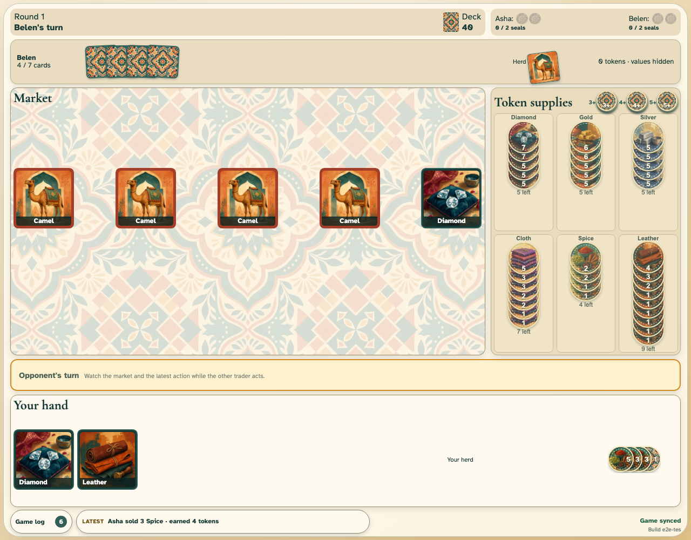
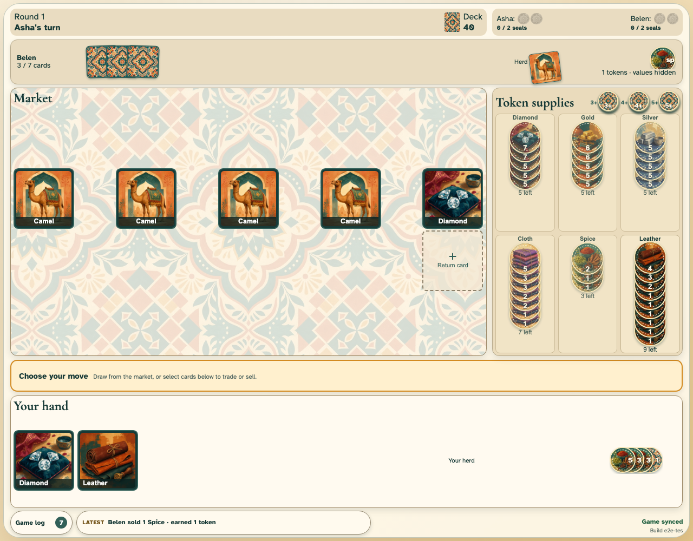

# Sell goods and earn tokens

Physical chips leave their ordered supplies and fly to each seller before Belen completes an ordinary sale.

## A three-card sale awards ordered goods tokens and one hidden bonus

**Verifications:**

- [x] Asha sees the exact four-token award in the private stack
- [x] The public spice supply loses its three highest tokens
- [x] Belen sees the token count without Asha’s bonus value

## Belen completes a one-card ordinary-goods sale

**Verifications:**

- [x] The next ordered spice token belongs to Belen
- [x] Asha sees only Belen’s public token count
- [x] Each seller’s cards and awarded chips animate for the observer and remain in the log
