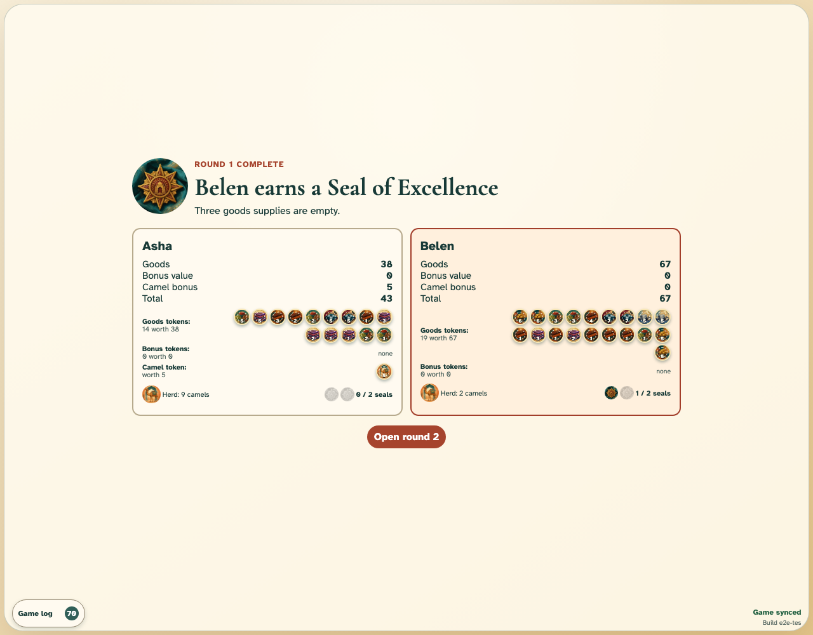
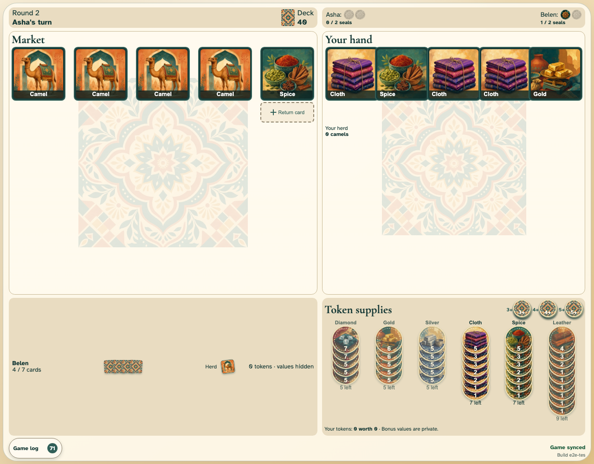

# Round end and scoring

Both traders complete an ordinary full round, reveal its exact score, and open a fresh market for the loser.

## The round ends and reveals its score after 65 ordinary actions

**Verifications:**

- [x] Exactly one trader earns the first seal
- [x] Every collected token is revealed with its value
- [x] Both clients converge on the same winner and score review

## The previous loser starts with reset round components

**Verifications:**

- [x] Round two starts with the loser as active trader on both clients
- [x] The market and all six token supplies are reset
