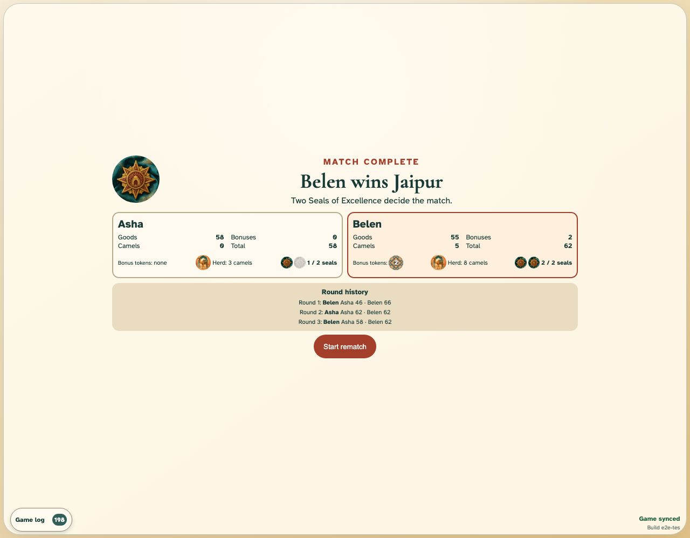
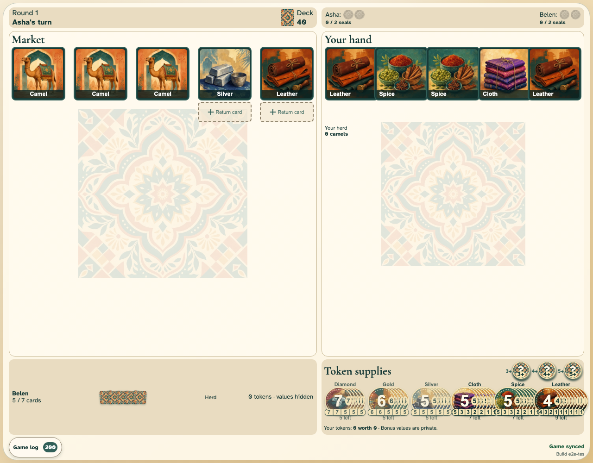

# Complete best-of-three game

Asha and Belen play production-size rounds until one earns two seals, then begin a clean rematch.

## The match ends after 3 rounds and 191 ordinary actions

**Verifications:**

- [x] The winner has exactly two seals and no further turn is available
- [x] Every completed round remains in the immutable visible history
- [x] Both clients converge on the final Jaipur winner

## The same traders begin a fresh first-to-two epoch

**Verifications:**

- [x] The rematch starts at round one with reset seals and components
- [x] The rematch is live on both clients and the old result is no longer active
