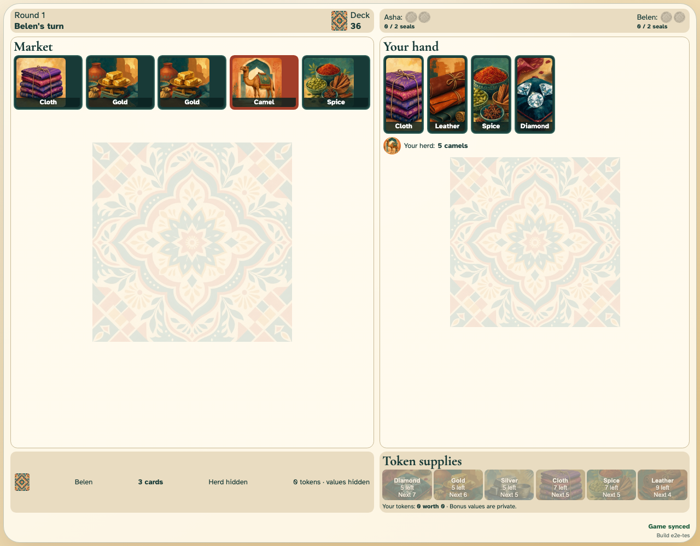
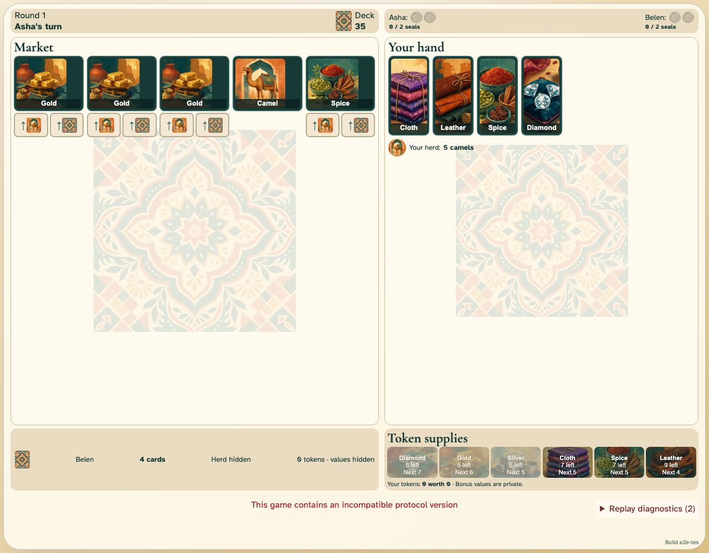

# Reconnect, replay, and conflicts

Belen replays a cached game after a browser-network interruption; concurrent, duplicate, and incompatible events remain visible but harmless.

## A trader with an interrupted browser network keeps a stable cached projection

**Verifications:**

- [x] Belen remains on the cached turn while Asha continues the canonical game

## Reconnect and reload replay the same canonical state

**Verifications:**

- [x] Both clients converge without rejoining or losing private state

## Invalid concurrent and incompatible entries cannot corrupt replay

**Verifications:**

- [x] The first canonical action applies and the stale concurrent action is ignored
- [x] An incompatible version produces a blocking accessible alert
