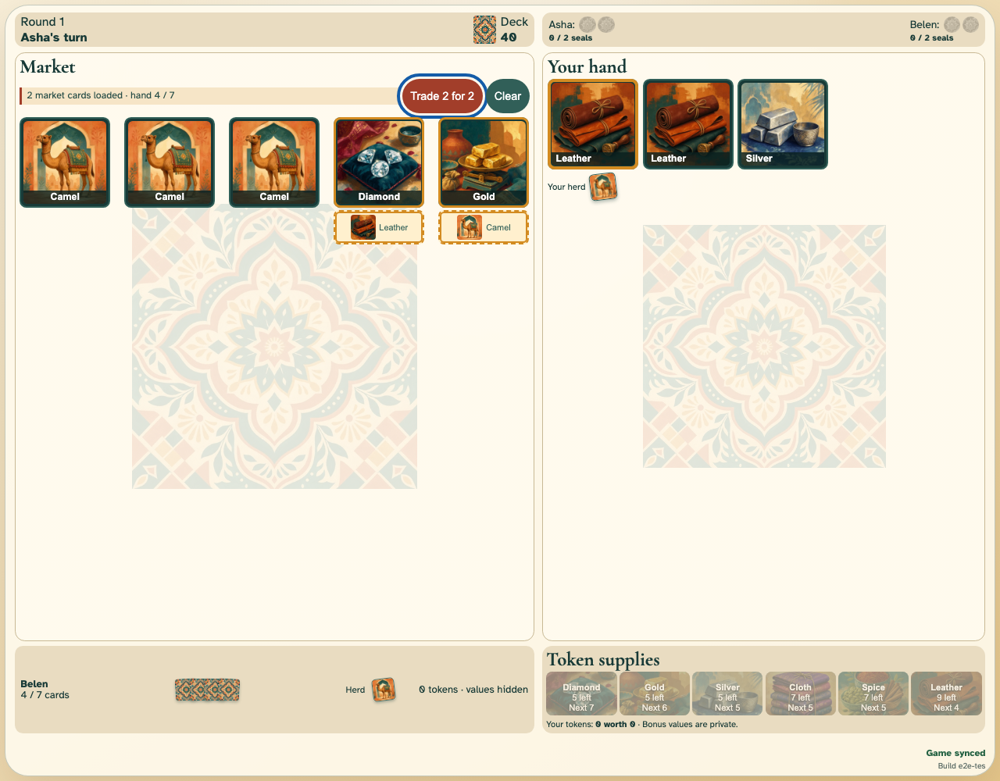
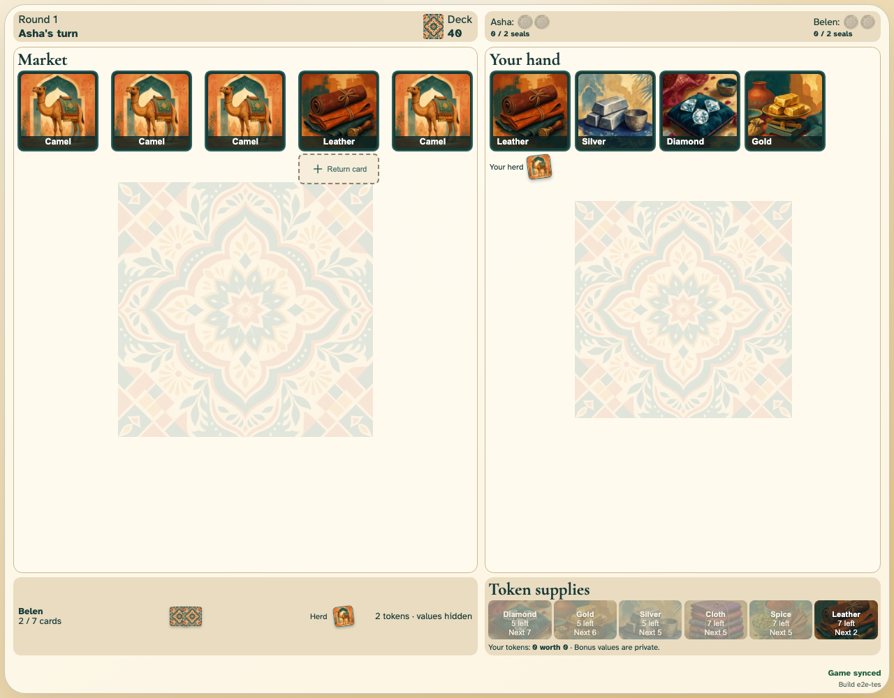

# Responsive and accessible complete game

The complete market remains legible and operable by keyboard and touch at phone portrait, phone landscape, tablet, and desktop sizes.

## A direct exchange is composed by drag and drop plus keyboard routing

**Verifications:**

- [x] Both dashed return targets expose their loaded pressed state
- [x] Market, hand, and herd cards preserve their physical footprints
- [x] Keyboard focus is visible and turn changes are announced politely
- [x] All available controls meet the 44-pixel touch target and have accessible names
- [x] Reduced-motion preference removes card transitions

## The synchronized table exposes every state without relying on colour

**Verifications:**

- [x] Market, private hand, public camel herds, concealed opponent hand, and supplies remain labelled
- [x] Connection state remains announced without an offline-mode control
- [x] All remaining controls retain accessible names and touch-sized targets
- [x] The complete table fits the viewport without document scrolling
