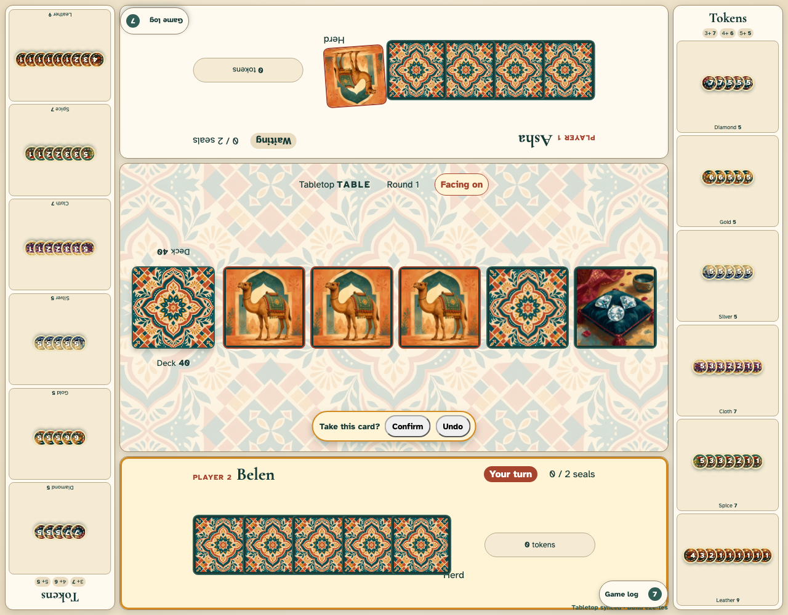
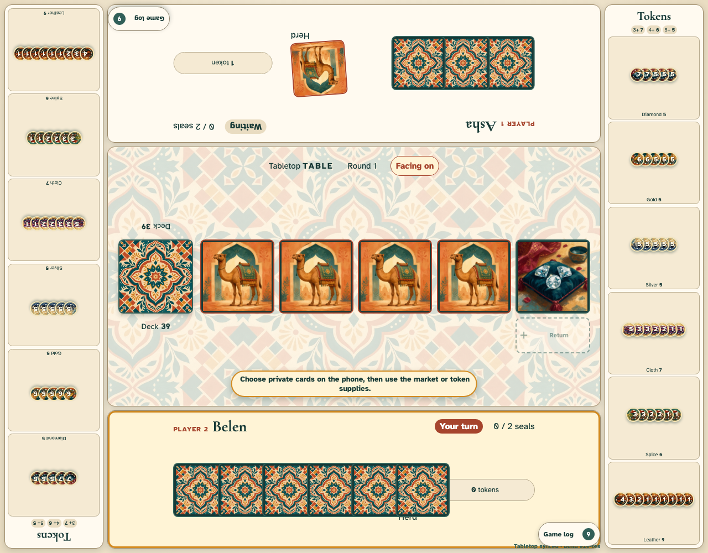

# Shared tabletop mode

A neutral tabletop keeps public play on the shared screen while each QR-joined phone shows only its trader’s private hand and return selections.

## A pending draw keeps every market and token position stable

**Verifications:**

- [x] The selected market slot remains face down until the active trader confirms or undoes the draw
- [x] The confirmation prompt appears upright beside the receiving player’s edge
- [x] Both seat-oriented token views show the same shared inventory

## Two opposite player edges share one market and mirrored token supplies

**Verifications:**

- [x] The top player UI and its upper-left log are rotated exactly 180 degrees
- [x] The lower player UI and lower-right log remain upright
- [x] The synchronized token views occupy opposite full-height rails and face their respective players
- [x] Either token view can complete the active player’s sale
- [x] Cards and supply tokens scale up substantially when a 4K tabletop is available
- [x] Action animation settles before the 200 ms turn handoff and market rotation
- [x] Market cards face the active player and return areas move to the player-near side
- [x] The draw pile sits left of the market row with a count readable from each seat
- [x] All five market cards keep permanent coordinates while return areas switch reserved sides
- [x] Private phone selections load face-down table targets and keep exact token values private
- [x] Public actions use direct card flights instead of a text notification overlay
- [x] The complete tabletop fits without document scrolling
