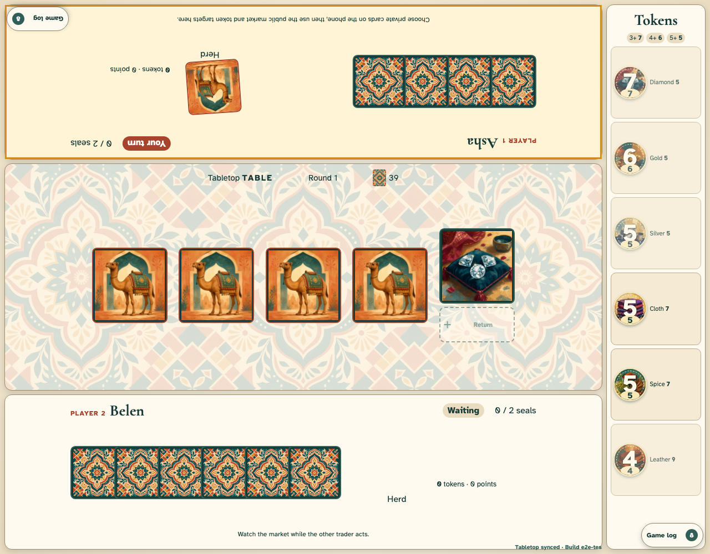

# Shared tabletop mode

A neutral tabletop keeps public play on the shared screen while each QR-joined phone shows only its trader’s private hand and return selections.

## Two opposite player edges share one market and one token rail

**Verifications:**

- [x] The top player UI and its upper-left log are rotated exactly 180 degrees
- [x] The lower player UI and lower-right log remain upright
- [x] Private phone selections load face-down table targets and complete an exchange
- [x] Public actions use direct card flights instead of a text notification overlay
- [x] The complete tabletop fits without document scrolling
