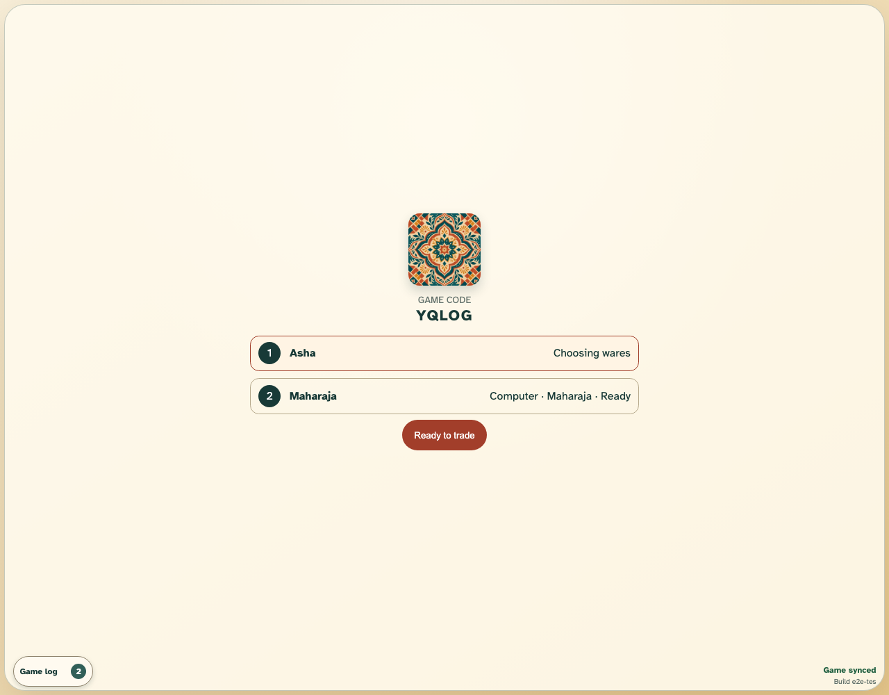
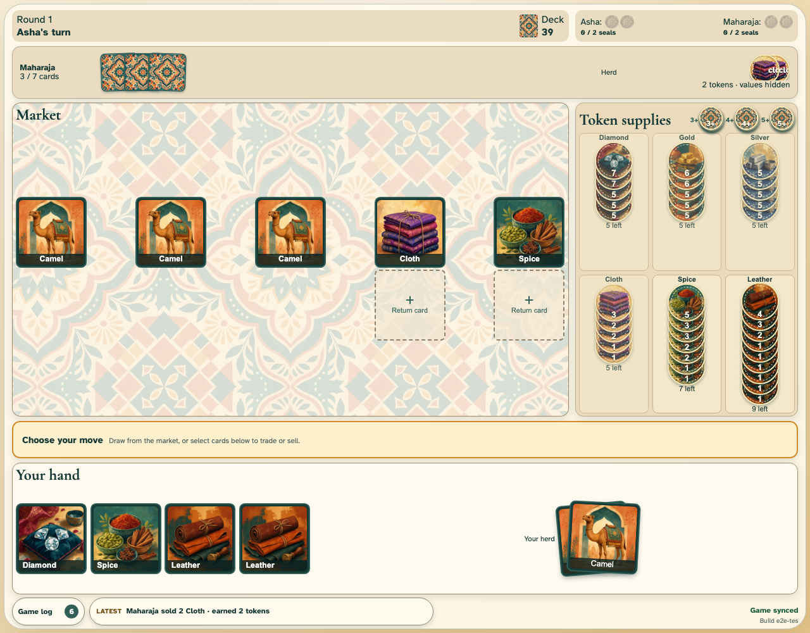

# Client-controlled computer opponent

A single browser connection runs private-state-safe Maharaja search and drives the logical computer seat.

## The computer occupies the ready second seat

**Verifications:**

- [x] The generated room contains only Asha and the Maharaja computer
- [x] Only the human needs to ready before opening the market

## The computer chooses and records a legal reply

**Verifications:**

- [x] Play returns to Asha after the local computer completes one turn
- [x] The shared append-only game log attributes the reply to Maharaja
- [x] The opponent remains a normal concealed hand and graphical public herd
